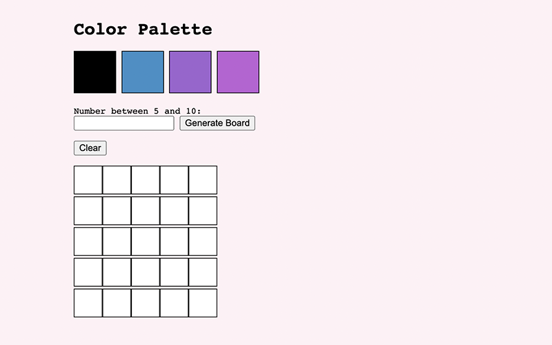

```JavaScript
const aboutMe = {
  name: 'Felipe Krein Rocha',
  location: 'São Paulo, Brazil',
  linkedIn: 'https://www.linkedin.com/in/felipe-krein-rocha/',
  email: 'felipekrein@gmail.com',
  tools: ['HTML', 'CSS', 'JavaScript ES6+', 'React', 'Redux', 'Jest' 'RTL'],
};
```

<h2 align="left">Selected Projects</h2>

<table>
  
  <tr>
     <td valign="top">
      <h3 align="left">React Tunes</h3>
      <p><a href="https://fkrein1.github.io/react-tunes/">GitHub Page</a>, <a href="https://github.com/fkrein1/react-tunes">Repository</a></p>
      <p>React, Jest, RTL, Browser Router and CSS</p>
      
    </td>
    <td valign="top">
      <h3 align="left">Business Landing Page</h3>
      <p><a href="https://fkrein1.github.io/simple-landing-page/">GitHub Page</a>, <a href="https://github.com/fkrein1/simple-landing-page">Repository</a></p>
      <p>CSS, HTML and JavaScript</p>
      
    </td>
  </tr>
  <tr>
     <td valign="top">
      <h3 align="left">Pixel Art</h3>
      <p><a href="https://fkrein1.github.io/pixel-art/">GitHub Page</a>, <a href="https://github.com/fkrein1/pixel-art">Repository</a></p>
      <p>CSS, HTML and JavaScript</p>
      
    </td>
  </tr>
  
</table>
