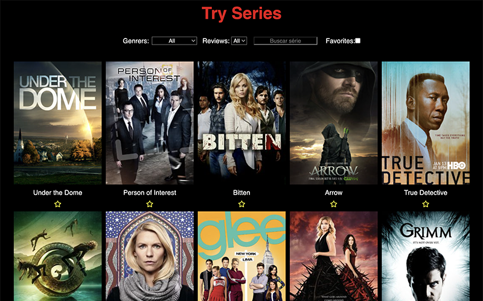

<h2>Hi, folks 👋</h2>
My name is Felipe Krein and I'am a React Front End Developer.  I am from São Paulo, Brazil and you can reach me at <a href="https://www.linkedin.com/in/felipe-krein-rocha/">LinkedIn</a>. 

<h3 align="left">Tools:</h3>

  
  
  
  
  
  
  
  
  
<!--   
  
   -->

<h3 align="left">Selected Projects</h3>
<table>
  
  <tr>
     <td valign="top">
      <h3 align="left">Trivia</h3>
      
<a href="https://fkrein1.github.io/trivia/">GitHub Page</a>, <a href="https://github.com/fkrein1/trivia">Repository</a>

       
React, Redux, Jest and RTL

      
    </td>
     <td valign="top">
      <h3 align="left">Travel Wallet</h3>
      
<a href="https://fkrein1.github.io/travel-wallet/">GitHub Page</a>, <a href="https://github.com/fkrein1/travel-wallet">Repository</a>

       
React, Redux, Jest and RTL

      
    </td>
     <td valign="top">
      <h3 align="left">React Tunes</h3>
      
<a href="https://fkrein1.github.io/react-tunes/">GitHub Page</a>, <a href="https://github.com/fkrein1/react-tunes">Repository</a>

      
React and React Router

      
    </td>
  </tr>
  <tr>
     <td valign="top">
      <h3 align="left">Business Landing Page</h3>
      
<a href="https://fkrein1.github.io/business-landing-page/">GitHub Page</a>, <a href="https://github.com/fkrein1/business-landing-page">Repository</a>

      
CSS, HTML and JavaScript

      
    </td>
     <td valign="top">
      <h3 align="left">Try Series</h3>
      
<a href="https://fkrein1.github.io/try-series/">GitHub Page</a>, <a href="https://github.com/fkrein1/try-series">Repository</a>

      
CSS, HTML and JavaScript

      
    </td>    
     <td valign="top">
      <h3 align="left">Pixel Art</h3>
      
<a href="https://fkrein1.github.io/pixel-art/">GitHub Page</a>, <a href="https://github.com/fkrein1/pixel-art">Repository</a>

      
CSS, HTML and JavaScript

      
    </td>
  </tr>
  
</table>
