<h2>Hi, folks 👋</h2>
My name is Felipe Krein Rocha and I'm a Software Developer.
 
 
You can reach me at
<a href="https://www.linkedin.com/in/felipe-krein-rocha/"
  ><strong>LinkedIn</strong></a
>.

<h3 align="left">Technologies</h3>

  
  
  
  
  
  

  

<h3 align="left">Projects</h3>
<table>
  <tr>
    <td valign="top">
      <h3 align="left">Deckify</h3>
      
<a href="https://deckify.ai/">Site</a>

      
T3 Stack: Next.js, Prisma, tRPC, Tailwind

      
    </td>
    <td valign="top">
      <h3 align="left">DALL·E ART</h3>
      

        <a href="https://dalleart.vercel.app">Site</a>,
        <a href="https://github.com/fkrein1/dall-e">Repo</a>
      

      
React, Node and Prisma

      <a href="https://dalleart.vercel.app"
        >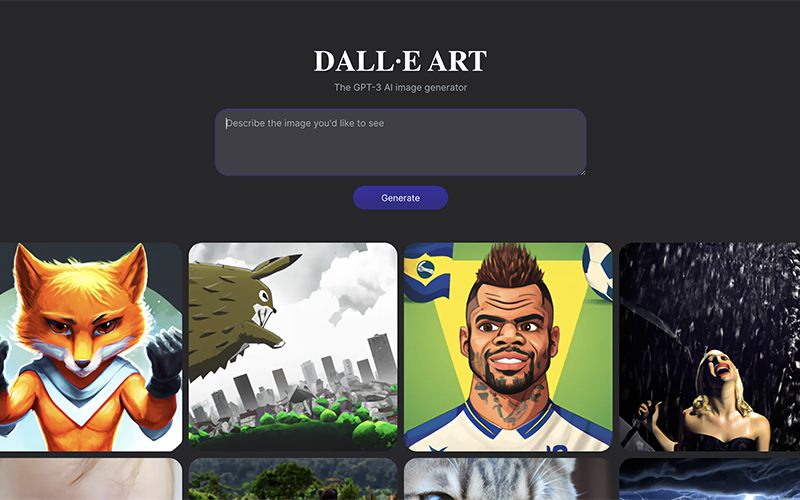</a>
    </td>
    <td valign="top">
      <h3 align="left">Venmo</h3>
      

        <a href="https://github.com/fkrein1/venmo">Repo</a>
      

      
React, Node and Prisma

      <a href="https://github.com/fkrein1/venmo"
        >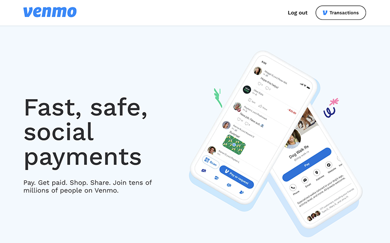</a>
    </td>
  </tr>
  <tr>
    <td valign="top">
      <h3 align="left">Wine Quiz</h3>
      

        <a href="https://wine-quiz-fkrein1.vercel.app/">Site</a>,
        <a href="https://github.com/fkrein1/wine-quiz">Repo</a>
      

      
React, Typescript and GraphQL

      <a href="https://wine-quiz-fkrein1.vercel.app/"
        >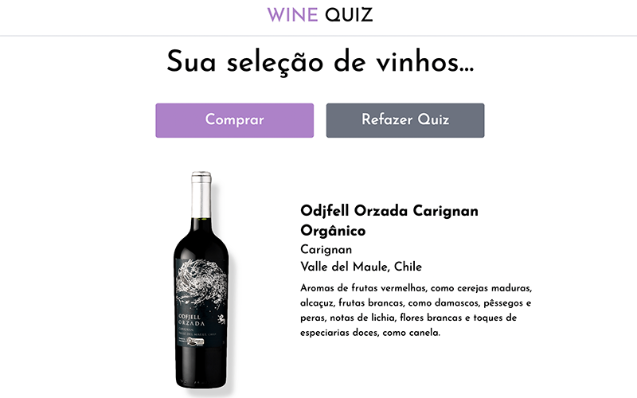</a>
    </td>
    <td valign="top">
      <h3 align="left">Plant Manager</h3>
      

        <a href="https://github.com/fkrein1/plant-manager">Repo</a>
      

      
React Native and Typescript

      <a href="https://github.com/fkrein1/plant-manager"
        >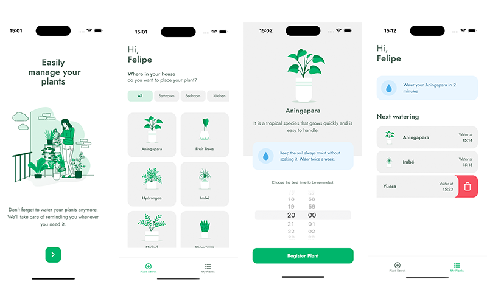</a>
    </td>
    <td valign="top">
      <h3 align="left">Coffee Delivery</h3>
      

        <a href="https://coffee-delivery-lyart.vercel.app/">Demo</a>,
        <a href="https://github.com/fkrein1/coffee-delivery">Repo</a>
      

      
React, Node and Prisma

      
    </td>
  </tr>
  <tr>
    <td valign="top">
      <h3 align="left">Habits Tracker</h3>
      

        <a href="https://github.com/fkrein1/habits">Repo</a>
      

      
React Native, Typescript and Node

      <a href="https://github.com/fkrein1/habits"
        >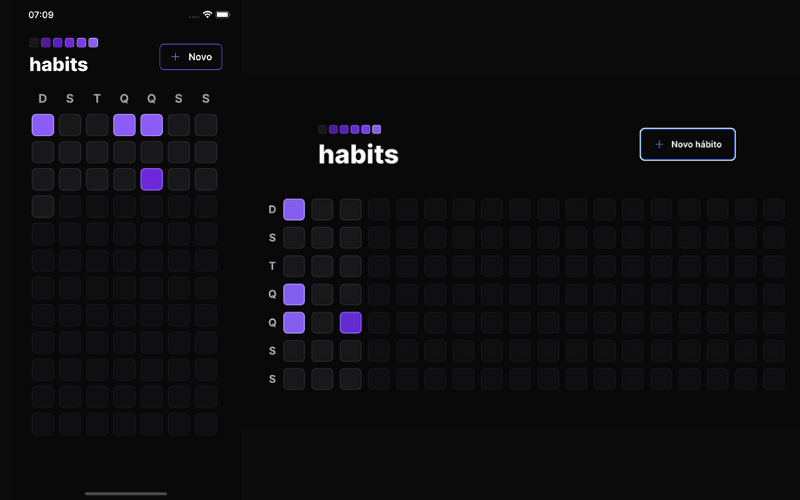</a>
    </td>
    <td valign="top">
      <h3 align="left">TFC Football Club</h3>
      

        <a href="https://github.com/fkrein1/tfc-football-club">Repo</a>
      

      
Typescript, Express and Sequelize

      
    </td>
    <td valign="top">
      <h3 align="left">Mongo Car Shop API</h3>
      

        <a href="https://github.com/fkrein1/mongo-car-shop-api">Repo</a>
      

      
MongoDB, Mongoose and Typescript

      <a href="https://github.com/fkrein1/mongo-car-shop-api"
        >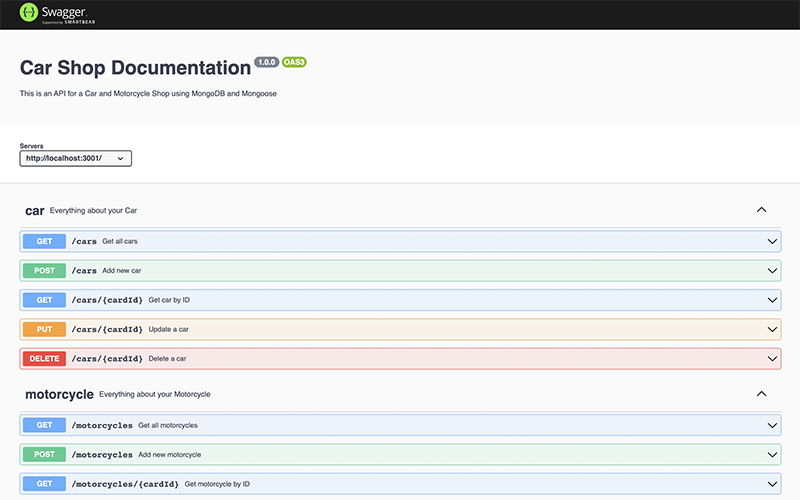</a>
    </td>
  </tr>
  <tr>
    <td valign="top">
      <h3 align="left">eSports</h3>
      

        <a href="https://github.com/fkrein1/esports">Repo</a>
      

      
React, Express and Prisma ORM

      
    </td>
    <td valign="top">
      <h3 align="left">Recipe App</h3>
      

        <a href="https://recipe-app-flame.vercel.app/">Demo</a>,
        <a href="https://github.com/fkrein1/recipe-app">Repo</a>
      

      
React, Sass and Vite

      <a href="https://recipe-app-flame.vercel.app/"
        >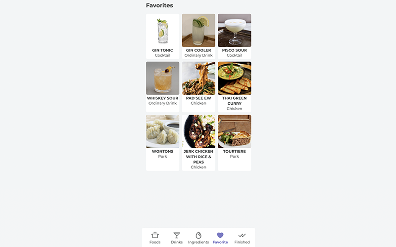</a>
    </td>
    <td valign="top">
      <h3 align="left">Food Lab</h3>
      

        <a href="https://food-lab.vercel.app/">Demo</a>,
        <a href="https://github.com/fkrein1/food-lab">Repo</a>
      

      
GraphCMS, GraphQL and Tailwind

      <a href="https://food-lab.vercel.app/"
        >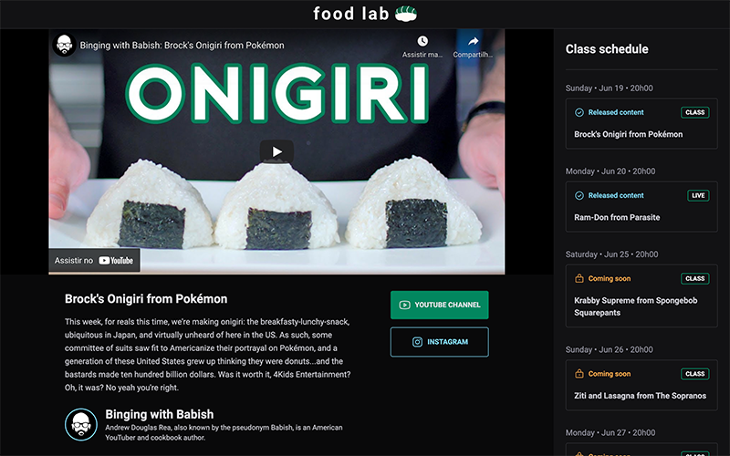</a>
    </td>
  </tr>
  <tr>
    <td valign="top">
      <h3 align="left">Letmeask</h3>
      

        <a href="https://letmeask-8f3d9.web.app/">Demo</a>,
        <a href="https://github.com/fkrein1/letmeask">Repo</a>
      

      
Typescript, React and Firebase

      <a href="https://letmeask-8f3d9.web.app/"
        >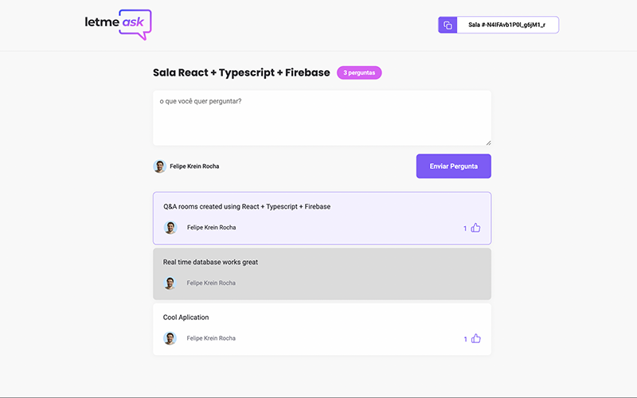</a>
    </td>
    <td valign="top">
      <h3 align="left">Star Wars Planets</h3>
      

        <a href="https://fkrein1.github.io/starwars-planets/">Demo</a>,
        <a href="https://github.com/fkrein1/starwars-planets">Repo</a>
      

      
React, Hooks and Sass

      <a href="https://fkrein1.github.io/starwars-planets/"
        >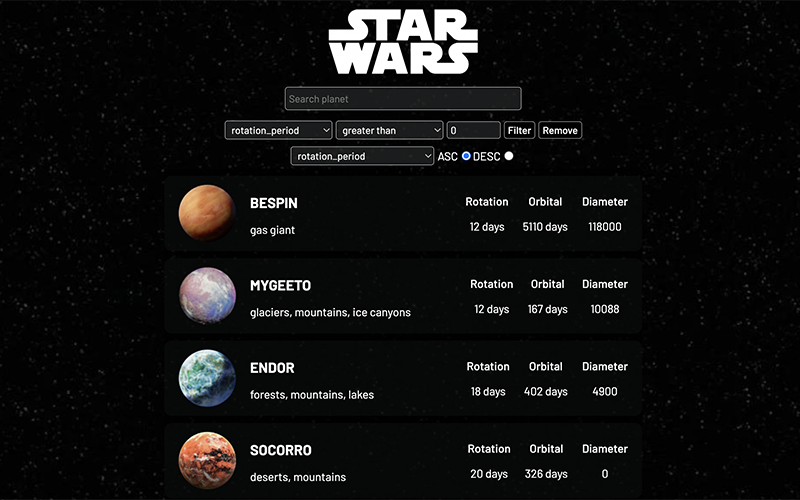</a>
    </td>
    <td valign="top">
      <h3 align="left">Trivia</h3>
      

        <a href="https://fkrein1.github.io/trivia/">Demo</a>,
        <a href="https://github.com/fkrein1/trivia">Repo</a>
      

      
React, Redux, Jest and RTL

      <a href="https://fkrein1.github.io/trivia/"
        >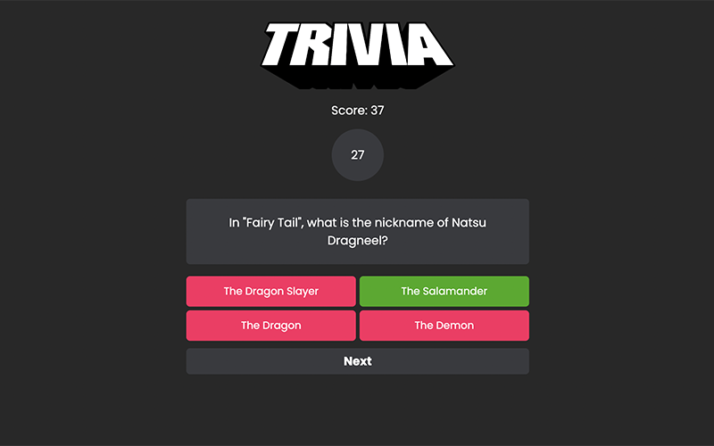</a>
    </td>
  </tr>
  <tr>
    <td valign="top">
      <h3 align="left">Smart Fit</h3>
      

        <a href="https://smartfit-brown.vercel.app/">Demo</a>,
        <a href="https://github.com/fkrein1/smartfit">Repo</a>
      

      
React, Typescript and Tailwind

      <a href="https://smartfit-brown.vercel.app/"
        >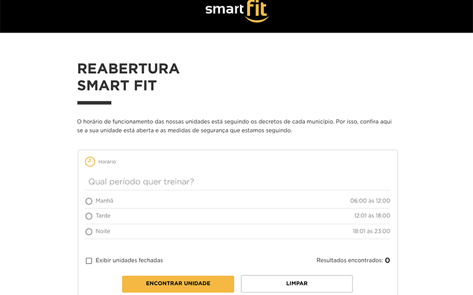</a>
    </td>
    <td valign="top">
      <h3 align="left">Travel Wallet</h3>
      

        <a href="https://fkrein1.github.io/travel-wallet/">Demo</a>,
        <a href="https://github.com/fkrein1/travel-wallet">Repo</a>
      

      
React, Redux, Jest and RTL

      <a href="https://fkrein1.github.io/travel-wallet/"
        >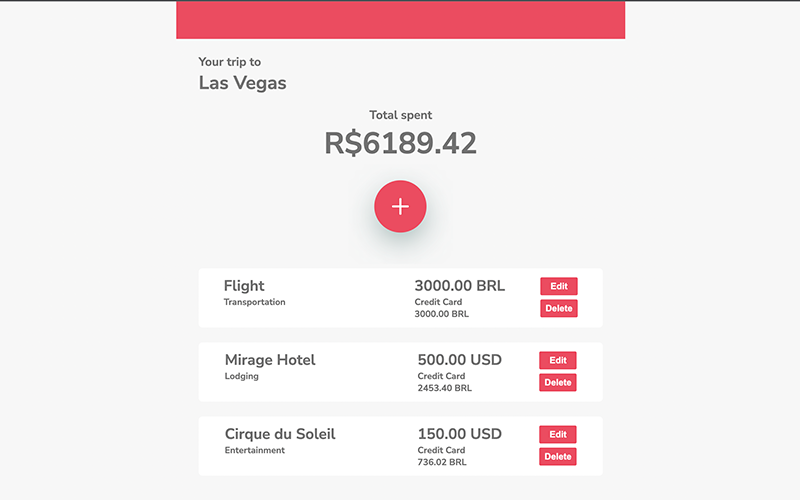</a>
    </td>
    <td valign="top">
      <h3 align="left">React Tunes</h3>
      

        <a href="https://fkrein1.github.io/react-tunes/">Demo</a>,
        <a href="https://github.com/fkrein1/react-tunes">Repo</a>
      

      
React and React Router

      
    </td>
  </tr>
  <tr>
    <td valign="top">
      <h3 align="left">GitHub Blog</h3>
      

        <a href="https://github-blog-bice.vercel.app/">Demo</a>,
        <a href="https://github.com/fkrein1/github-blog">Repo</a>
      

      
React, Typescript and Styled Components

      <a href="https://github-blog-bice.vercel.app/"
        >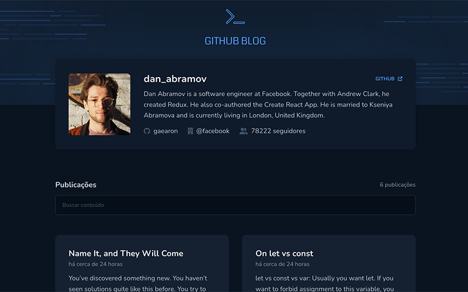</a>
    </td>
    <td valign="top">
      <h3 align="left">GitHub Clone</h3>
      

        <a href="https://github-clone-lovat.vercel.app/">Demo</a>,
        <a href="https://github.com/fkrein1/github-clone">Repo</a>
      

      
React and Styled Components

      <a href="https://github-clone-lovat.vercel.app/"
        >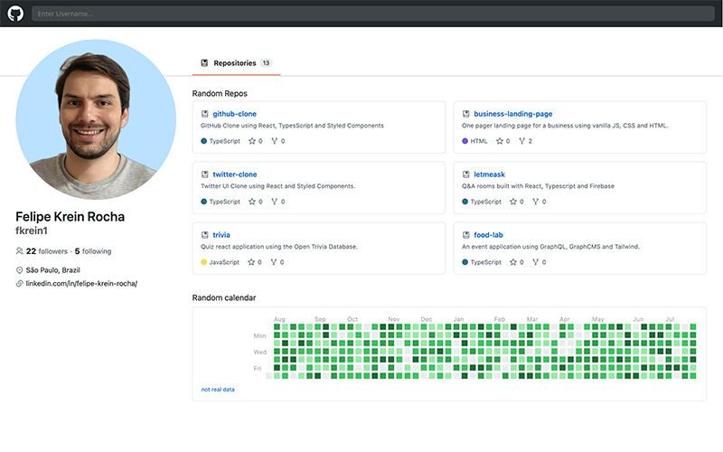</a>
    </td>
    <td valign="top">
      <h3 align="left">Twitter Clone</h3>
      

        <a href="https://fkrein1.github.io/twitter-clone/">Demo</a>,
        <a href="https://github.com/fkrein1/twitter-clone">Repo</a>
      

      
React and Styled Components

      <a href="https://fkrein1.github.io/twitter-clone/"
        >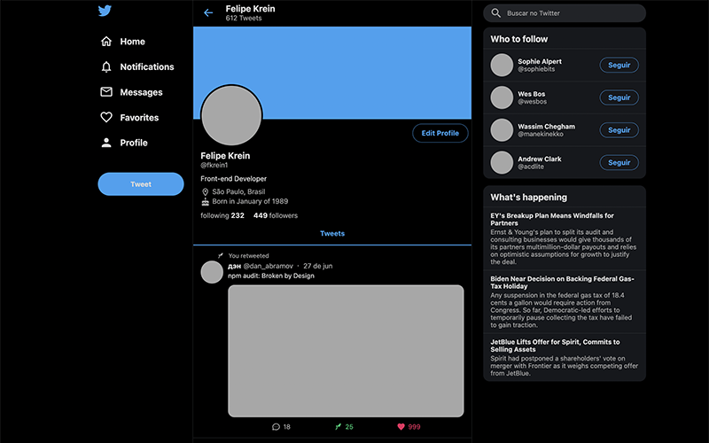</a>
    </td>
  </tr>
  <tr>
    <td valign="top">
      <h3 align="left">Business Landing Page</h3>
      

        <a href="https://fkrein1.github.io/business-landing-page/">Demo</a>,
        <a href="https://github.com/fkrein1/business-landing-page">Repo</a>
      

      
CSS, HTML and JavaScript

      <a href="https://fkrein1.github.io/business-landing-page/"
        >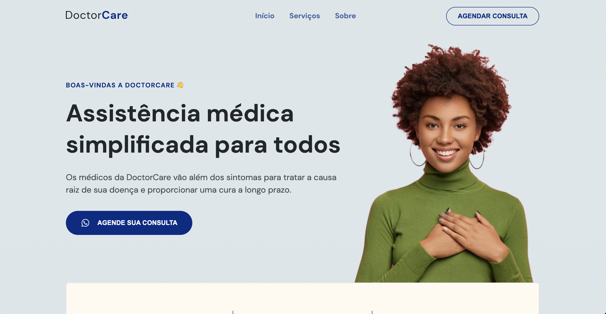</a>
    </td>
  </tr>
</table>
