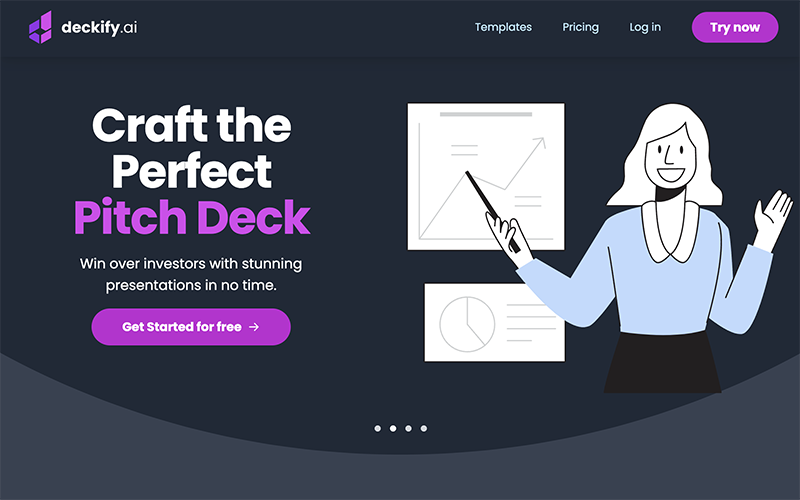

<h2>Hi, folks 👋</h2>
My name is Felipe Krein Rocha and I'm a Software Developer.
 
 
You can reach me at
<a href="https://www.linkedin.com/in/felipe-krein-rocha/"
  ><strong>LinkedIn</strong></a
>.

<h3 align="left">Technologies</h3>

  
  
  
  
  
  

  

<h3 align="left">Projects</h3>
<table>
  <tr>
    <td valign="top">
      <h3 align="left">Deckify</h3>
      

        <a href="https://deckify.ai/">Site</a>,
        <a href="https://github.com/fkrein1/deckify">Repo</a>
      

      
Next.js, Prisma, tRPC, Tailwind

      
    </td>
    <td valign="top">
      <h3 align="left">DALL·E ART</h3>
      

        <a href="https://dalleart.vercel.app">Site</a>,
        <a href="https://github.com/fkrein1/dall-e">Repo</a>
      

      
React, Node and Prisma

      
    </td>
    <td valign="top">
      <h3 align="left">Venmo</h3>
      

        <a href="https://github.com/fkrein1/venmo">Repo</a>
      

      
React, Node and Prisma

      
    </td>
  </tr>
  <tr>
    <td valign="top">
      <h3 align="left">Wine Quiz</h3>
      

        <a href="https://wine-quiz-fkrein1.vercel.app/">Site</a>,
        <a href="https://github.com/fkrein1/wine-quiz">Repo</a>
      

      
React, Typescript and GraphQL

      
    </td>
    <td valign="top">
      <h3 align="left">Plant Manager</h3>
      

        <a href="https://github.com/fkrein1/plant-manager">Repo</a>
      

      
React Native and Typescript

      
    </td>
    <td valign="top">
      <h3 align="left">TFC Football Club</h3>
      

        <a href="https://github.com/fkrein1/tfc-football-club">Repo</a>
      

      
Typescript, Express and Sequelize

      
    </td>
  </tr>
</table>
